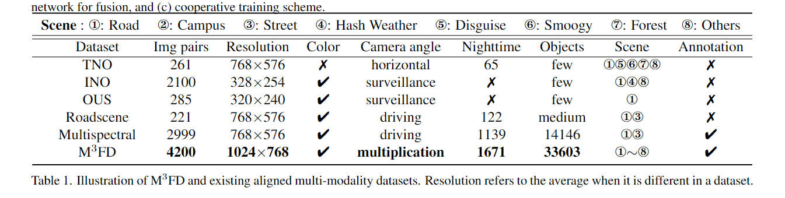
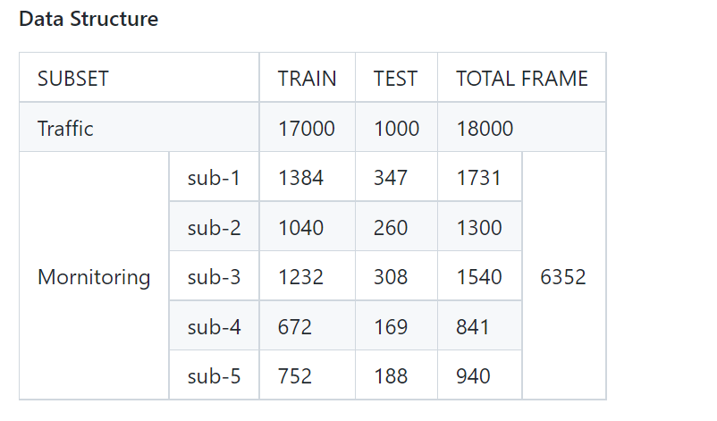

# Image Fusion
This repository contains code reproductions of existing state-of-the-art image fusion models, our work is still in progress.    

## 多模态图像融合(Multi-Modal Image Fusion)
### 红外和可见光图像融合(Infrared and visible image fusion)
<table>
    <thead>
      <tr>
        <th>方法</th>
        <th>标题</th>
        <th>论文</th>
        <th>代码</th>
        <th>发表期刊或会议</th>
        <th>基础框架</th>
        <th>监督范式</th>
        <th>发表年份</th>
        <th>引用量</th>
        <th>复现情况</th>
      </tr>
    </thead>
    <tbody>
      <tr>
        <td>DenseFuse</td>
        <td>DenseFuse: A Fusion Approach to Infrared and Visible Images</td>
        <td><a href="https://ieeexplore.ieee.org/abstract/document/8580578/">Paper</a></td>
        <td><a href="https://github.com/hli1221/imagefusion_densefuse">Code</a></td>
        <td>TIP</td>
        <td>AE</td>
        <td>自监督</td>
        <td>2019</td>
        <td>569</td>
        <td>✓</td>
      </tr>
      <tr>
        <td>FusionGAN</td>
        <td>FusionGAN: A generative adversarial network for infrared and&nbsp;&nbsp;&nbsp;visible image fusion</td>
        <td><a href="https://www.sciencedirect.com/science/article/abs/pii/S1566253518301143%3Fvia%253Dihub">Paper</a></td>
        <td><a href="https://github.com/jiayi-ma/FusionGAN">Code</a></td>
        <td>InfFus</td>
        <td>GAN</td>
        <td>无监督</td>
        <td>2019</td>
        <td>711</td>
        <td> </td>
      </tr>
      <tr>
        <td>DDcGAN</td>
        <td>Learning a Generative Model for Fusing Infrared and Visible&nbsp;&nbsp;&nbsp;Images via Conditional Generative Adversarial Network with Dual&nbsp;&nbsp;&nbsp;Discriminators</td>
        <td><a href="https://www.ijcai.org/proceedings/2019/0549.pdf">Paper</a></td>
        <td><a href="https://github.com/hanna-xu/DDcGAN">Code</a></td>
        <td>IJCAI</td>
        <td>GAN</td>
        <td>无监督</td>
        <td>2019</td>
        <td>51</td>
      </tr>
      <tr>
        <td>NestFuse</td>
        <td>NestFuse: An Infrared and Visible Image Fusion Architecture&nbsp;&nbsp;&nbsp;Based on Nest Connection and Spatial/Channel Attention Models</td>
        <td><a href="https://ieeexplore.ieee.org/document/9127964/">Paper</a></td>
        <td><a href="https://github.com/hli1221/imagefusion-nestfuse">Code</a></td>
        <td>TIM</td>
        <td>AE</td>
        <td>自监督</td>
        <td>2020</td>
        <td>125</td>
        <td>✓</td>
      </tr>
      <tr>
        <td>DDcGAN</td>
        <td>DDcGAN: A dual-discriminator conditional generative&nbsp;&nbsp;&nbsp;adversarial network for multi-resolution image fusion</td>
        <td><a href="https://ieeexplore.ieee.org/abstract/document/9031751/">Paper</a></td>
        <td><a href="https://github.com/hanna-xu/DDcGAN">Code</a></td>
        <td>TIP </td>
        <td>GAN</td>
        <td>无监督</td>
        <td>2020</td>
        <td>307</td>
        <td>✓</td>
      </tr>
      <tr>
        <td>DIDFuse</td>
        <td>DIDFuse: Deep Image Decomposition for Infrared and Visible Image Fusion</td>
        <td><a href="https://arxiv.org/abs/2003.09210">Paper</a></td>
        <td><a href="https://github.com/Zhaozixiang1228/IVIF-DIDFuse">Code</a></td>
        <td>IJCAI </td>
        <td>AE</td>
        <td>自监督</td>
        <td>2020</td>
        <td>40</td>
        <td> </td>
      </tr>
      <tr>
        <td>RFN-Nest</td>
        <td>RFN-Nest: An end-to-end residual fusion network for infrared&nbsp;&nbsp;&nbsp;and visible images</td>
        <td><a href="https://www.sciencedirect.com/science/article/abs/pii/S1566253521000440%3Fvia%253Dihub">Paper</a></td>
        <td><a href="https://github.com/hli1221/imagefusion-rfn-nest">Code</a></td>
        <td>InfFus</td>
        <td>AE</td>
        <td>自监督</td>
        <td>2021</td>
        <td>112</td>
        <td>✓</td>
      </tr>
      <tr>
        <td>CSF</td>
        <td>Classification Saliency-Based Rule for Visible and Infrared&nbsp;&nbsp;&nbsp;Image Fusion</td>
        <td><a href="https://ieeexplore.ieee.org/abstract/document/9502544">Paper</a></td>
        <td><a href="https://github.com/hanna-xu/CSF">Code</a></td>
        <td>TCI</td>
        <td>AE</td>
        <td>自监督</td>
        <td>2021</td>
        <td>19</td>
        <td> </td>
      </tr>
      <tr>
        <td>DRF</td>
        <td>DRF: Disentangled Representation for Visible and Infrared&nbsp;&nbsp;&nbsp;Image Fusion</td>
        <td><a href="https://ieeexplore.ieee.org/document/9345717/">Paper</a></td>
        <td><a href="https://github.com/hanna-xu/DRF">Code</a></td>
        <td>TIM</td>
        <td>AE</td>
        <td>自监督</td>
        <td>2021</td>
        <td>41</td>
        <td> </td>
      </tr>
      <tr>
        <td>SEDRFuse</td>
        <td>SEDRFuse: A Symmetric Encoder–Decoder With Residual Block&nbsp;&nbsp;&nbsp;Network for Infrared and Visible Image Fusion</td>
        <td><a href="https://ieeexplore.ieee.org/document/9187663">Paper</a></td>
        <td><a href="https://github.com/jianlihua123/SEDRFuse">Code</a></td>
        <td>TIM</td>
        <td>AE</td>
        <td>自监督</td>
        <td>2021</td>
        <td>43</td>
        <td>✓</td>
      </tr>
      <tr>
        <td>MFEIF</td>
        <td>Learning a Deep Multi-Scale Feature Ensemble and an&nbsp;&nbsp;&nbsp;Edge-Attention Guidance for Image Fusion</td>
        <td><a href="https://ieeexplore.ieee.org/document/9349250">Paper</a></td>
        <td></td>
        <td>TCSVT</td>
        <td>AE</td>
        <td>自监督</td>
        <td>2021</td>
        <td>38</td>
        <td> </td>
      </tr>
      <tr>
        <td>Meta-Learning</td>
        <td>Different Input Resolutions and Arbitrary Output Resolution: A&nbsp;&nbsp;&nbsp;Meta Learning-Based Deep Framework for Infrared and Visible Image Fusion</td>
        <td><a href="https://ieeexplore.ieee.org/document/9394791/">Paper</a></td>
        <td></td>
        <td>TIP</td>
        <td>CNN</td>
        <td>无监督</td>
        <td>2021</td>
        <td>15</td>
        <td> </td>
      </tr>
      <tr>
        <td>RXDNFuse</td>
        <td>RXDNFuse: A aggregated residual dense network for infrared and&nbsp;&nbsp;&nbsp;visible image fusion</td>
        <td><a href="https://www.sciencedirect.com/science/article/abs/pii/S1566253520304152%3Fvia%253Dihub">Paper</a></td>
        <td><a href="https://github.com/JinyuanLiu-CV/MFEIF">Code</a></td>
        <td>InfFus</td>
        <td>CNN</td>
        <td>无监督</td>
        <td>2021</td>
        <td>27</td>
        <td> </td>
      </tr>
      <tr>
        <td>STDFusionNet</td>
        <td>STDFusionNet: An Infrared and Visible Image Fusion Network&nbsp;&nbsp;&nbsp;Based on Salient Target Detection</td>
        <td><a href="https://ieeexplore.ieee.org/document/9416507">Paper</a></td>
        <td><a href="https://github.com/Linfeng-Tang/STDFusionNet">Code</a></td>
        <td>TIM</td>
        <td>CNN</td>
        <td>无监督</td>
        <td>2021</td>
        <td>67</td>
        <td> </td>
      </tr>
      <tr>
        <td>D2LE</td>
        <td>A Bilevel Integrated Model With Data-Driven Layer Ensemble for&nbsp;&nbsp;&nbsp;Multi-Modality Image Fusion</td>
        <td><a href="https://ieeexplore.ieee.org/document/9293146">Paper</a></td>
        <td></td>
        <td>TIP</td>
        <td>CNN</td>
        <td>无监督</td>
        <td>2021</td>
        <td>33</td>
        <td> </td>
      </tr>
      <tr>
        <td>HAF</td>
        <td>Searching a Hierarchically Aggregated Fusion Architecture for&nbsp;&nbsp;&nbsp;Fast Multi-Modality Image Fusion</td>
        <td><a href="https://dl.acm.org/doi/abs/10.1145/3474085.3475299%3Fcasa_token%3DtT48gSwVWjkAAAAA%3AQaDUAB7nLzWcByiAESzOTAgFjdh5kLxS8J612shuDn3RLLIOcU1AX7AhcvYT9UlGTub1mi85Tws">Paper</a></td>
        <td><a href="https://github.com/LiuzhuForFun/Hierarchical-NAS-Image-Fusion">Code</a></td>
        <td>ACM MM</td>
        <td>CNN</td>
        <td>无监督</td>
        <td>2021</td>
        <td>5</td>
        <td> </td>
      </tr>
      <tr>
        <td>SDDGAN</td>
        <td>Semantic-supervised Infrared and Visible Image Fusion via a&nbsp;&nbsp;&nbsp;Dual-discriminator Generative Adversarial Network</td>
        <td><a href="https://ieeexplore.ieee.org/document/9623476">Paper</a></td>
        <td><a href="https://github.com/WeiWu-WIT/SDDGAN">Code</a></td>
        <td>TMM</td>
        <td>GAN</td>
        <td>无监督</td>
        <td>2021</td>
        <td>7</td>
        <td> </td>
      </tr>
      <tr>
        <td>Detail-GAN</td>
        <td>Infrared and visible image fusion via detail preserving&nbsp;&nbsp;&nbsp;adversarial learning</td>
        <td><a href="https://www.sciencedirect.com/science/article/abs/pii/S1566253519300314%3Fvia%253Dihub">Paper</a></td>
        <td><a href="https://github.com/jiayi-ma/ResNetFusion">Code</a></td>
        <td>InfFus</td>
        <td>GAN</td>
        <td>无监督</td>
        <td>2021</td>
        <td>206</td>
        <td> </td>
      </tr>
      <tr>
        <td>Perception-GAN</td>
        <td>Image fusion based on&nbsp;&nbsp;&nbsp;generative adversarial network consistent with perception</td>
        <td><a href="https://www.sciencedirect.com/science/article/pii/S1566253521000439%3Fcasa_token%3D-LrGkXT12IMAAAAA%3A35WH5dIx-2zWPZ3sTFL3cgjjCK_17nkc0xYVkDXL8Pp51k3DIPtaNT8NWvuKoXlIOoRkKi87AZo0">Paper</a></td>
        <td><a href="https://github.com/thfylsty/imagefusion_Perceptual_FusionGan">Code</a></td>
        <td>InfFus</td>
        <td>GAN</td>
        <td>无监督</td>
        <td>2021</td>
        <td>28</td>
        <td> </td>
      </tr>
      <tr>
        <td>GAN-FM</td>
        <td>GAN-FM: Infrared and Visible&nbsp;&nbsp;&nbsp;Image Fusion Using GAN With Full-Scale Skip Connection and Dual Markovian&nbsp;&nbsp;&nbsp;Discriminators</td>
        <td><a href="https://ieeexplore.ieee.org/document/9573457">Paper</a></td>
        <td><a href="https://github.com/yuanjiteng/GAN-FM">Code</a></td>
        <td>TCI</td>
        <td>GAN</td>
        <td>无监督</td>
        <td>2021</td>
        <td>19</td>
        <td> </td>
      </tr>
      <tr>
        <td>AttentionFGAN</td>
        <td>AttentionFGAN: Infrared and Visible Image Fusion Using&nbsp;&nbsp;&nbsp;Attention-Based Generative Adversarial Networks</td>
        <td><a href="https:////ieeexplore.ieee.org/document/9103116/">Paper</a></td>
        <td></td>
        <td>TMM</td>
        <td>GAN</td>
        <td>无监督</td>
        <td>2021</td>
        <td>71</td>
        <td> </td>
      </tr>
      <tr>
        <td>GANMcC</td>
        <td>GANMcC: A Generative&nbsp;&nbsp;&nbsp;Adversarial Network With Multiclassification Constraints for Infrared and&nbsp;&nbsp;&nbsp;Visible Image Fusion</td>
        <td><a href="https://ieeexplore.ieee.org/abstract/document/9274337">Paper</a></td>
        <td><a href="https://github.com/jiayi-ma/GANMcC">Code</a></td>
        <td>TIM</td>
        <td>GAN</td>
        <td>无监督</td>
        <td>2021</td>
        <td>109</td>
        <td> </td>
      </tr>
      <tr>
        <td>MgAN-Fuse</td>
        <td>Multigrained Attention Network for Infrared and Visible Image&nbsp;&nbsp;&nbsp;Fusion</td>
        <td><a href="https://ieeexplore.ieee.org/document/9216075">Paper</a></td>
        <td></td>
        <td>TIM</td>
        <td>GAN</td>
        <td>无监督</td>
        <td>2021</td>
        <td>30</td>
        <td> </td>
      </tr>
      <tr>
        <td>TC-GAN</td>
        <td>Infrared and Visible Image&nbsp;&nbsp;&nbsp;Fusion via Texture Conditional Generative Adversarial Network</td>
        <td><a href="https://ieeexplore.ieee.org/abstract/document/9335976">Paper</a></td>
        <td></td>
        <td>TCSVT</td>
        <td>GAN</td>
        <td>无监督</td>
        <td>2021</td>
        <td>23</td>
        <td> </td>
      </tr>
      <tr>
        <td>AUIF</td>
        <td>Efficient and model-based infrared and visible image fusion via algorithm unrolling</td>
        <td><a href="https://ieeexplore.ieee.org/abstract/document/9416456/">Paper</a></td>
        <td><a href="https://github.com/Zhaozixiang1228/IVIF-AUIF-Net">Code</a></td>
        <td>TCSVT</td>
        <td>AE</td>
        <td>自监督</td>
        <td>2021</td>
        <td>14</td>
        <td> </td>
      </tr>
      <tr>
        <td>TarDAL</td>
        <td>Target-aware Dual Adversarial Learning and a Multi-scenario Multi-Modality Benchmark to Fuse Infrared and Visible for Object Detection</td>
        <td><a href="https://arxiv.org/abs/2203.16220v1">Paper</a></td>
        <td><a href="https://github.com/JinyuanLiu-CV/TarDAL">Code</a></td>
        <td>CVPR</td>
        <td>GAN</td>
        <td>无监督</td>
        <td>2022</td>
        <td>21</td>
        <td>✓</td>
      </tr>
      <tr>
        <td>RFNet</td>
        <td>RFNet: Unsupervised Network for Mutually Reinforcing Multi-modal Image Registration and Fusion</td>
        <td><a href="https://www.researchgate.net/publication/360238557_RFNet_Unsupervised_Network_for_Mutually_Reinforcing_Multi-modal_Image_Registration_and_Fusion">Paper</a></td>
        <td><a href="https://github.com/hanna-xu">Code</a></td>
        <td>CVPR</td>
        <td>CNN</td>
        <td>无监督</td>
        <td>2022</td>
        <td>7</td>
        <td> </td>
      </tr>
      <tr>
        <td>SeAFusion</td>
        <td>Image fusion in the loop of&nbsp;&nbsp;&nbsp;high-level vision tasks: A semantic-aware real-time infrared and visible&nbsp;&nbsp;&nbsp;image fusion network</td>
        <td><a href="https://www.sciencedirect.com/science/article/abs/pii/S1566253521002542%3Fvia%253Dihub">Paper</a></td>
        <td><a href="https://github.com/Linfeng-Tang/SeAFusion">Code</a></td>
        <td>InfFus</td>
        <td>CNN</td>
        <td>无监督</td>
        <td>2022</td>
        <td>52</td>
        <td> </td>
      </tr>
      <tr>
        <td>PIAFusion</td>
        <td>PIAFusion: A progressive infrared and visible image fusion&nbsp;&nbsp;&nbsp;network based on illumination aware</td>
        <td><a href="https://www.sciencedirect.com/science/article/abs/pii/S156625352200032X">Paper</a></td>
        <td><a href="https://github.com/Linfeng-Tang/PIAFusion" target="_blank" rel="noopener noreferrer">Code</a></td>        
        <td>InfFus</td>
        <td>CNN</td>
        <td>无监督</td>
        <td>2022</td>
        <td>20</td>
        <td> </td>
      </tr>      
      <tr>
        <td>UMF-CMGR</td>
        <td>Unsupervised Misaligned Infrared and Visible Image Fusion via Cross-Modality Image Generation and Registration</td>
        <td><a href="https://arxiv.org/pdf/2205.11876.pdf">Paper</a></td>
        <td><a href="https://github.com/wdhudiekou/UMF-CMGR" target="_blank" rel="noopener noreferrer">Code</a></td>        
        <td>IJCAI</td>
        <td>CNN</td>
        <td>无监督</td>
        <td>2022</td>
        <td>11</td>
        <td> </td>
      </tr>
      <tr>
        <td>DetFusion</td>
        <td>DetFusion: A Detection-driven Infrared and Visible Image Fusion Network</td>
        <td><a href="https://dl.acm.org/doi/abs/10.1145/3503161.3547902?casa_token=YmZKEkd1zVcAAAAA:wb0HbfopS60BwSh0_QAdHHjwNQ5ZoWxduwHfBd1NzLbMr32AOPcInC4TCbZ5KM9Ly1PbVIGkmg">Paper</a></td>
        <td><a href="https://github.com/SunYM2020/DetFusion" target="_blank" rel="noopener noreferrer">Code</a></td>        
        <td>ACM MM</td>
        <td>CNN</td>
        <td>无监督</td>
        <td>2022</td>
        <td>2</td>
        <td> </td>
      </tr>
      <tr>
        <td>DIVFusion</td>
        <td>DIVFusion: Darkness-free infrared and visible image fusion</td>
        <td><a href="https://authors.elsevier.com/c/1g4EB_ZdCkUn0I">Paper</a></td>
        <td><a href="https://github.com/Xinyu-Xiang/DIVFusion" target="_blank" rel="noopener noreferrer">Code</a></td>        
        <td>InfFus</td>
        <td>CNN</td>
        <td>无监督</td>
        <td>2023</td>
        <td>1</td>
        <td> </td>
      </tr>
    </tbody>
    </table>

## Datasets
### M3FD数据集

M3FD 包含高分辨率的红外和可见图像，涵盖各种场景下的不同对象类型 我们将 M3FD 中的所有 4200 个对齐对分为四种典型类型，即 Daytime、Overcast、Night 和 Challenge，其中有 10 个子场景如图 4 所示。同时，我们注释了 6 个类别的 33603 个对象，即 人像 , 汽车, 公共汽车, 摩托车, 卡车和灯, 常见于监控和自动驾驶。 M3FD 的数量和多样性为通过融合图像学习和评估目标检测提供了可能性。

下载地址

谷歌盘https://drive.google.com/drive/folders/1H-oO7bgRuVFYDcMGvxstT1nmy0WF_Y_6?usp=sharing

百度云https://pan.baidu.com/s/1GoJrrl_mn2HNQVDSUdPCrw?pwd=M3FD

### LLVIP数据集

LLVIP数据集包含 30976 张图像即15488 对，其中大部分是在非常黑暗的场景下拍摄的，并且所有图像在时间和空间上都严格对齐，且数据集中的行人被标记。

● 用于低光视觉的可见红外配对数据集

● 30976 张图像（15488 对）

● 24个黑暗场景，2个白天场景

● 支持图像到图像的转换（可见光到红外线，或红外线到可见光）、可见光和红外图像融合、弱光行人检测和红外行人检测

下载地址

谷歌盘

源数据raw：https://drive.google.com/u/0/uc?id=1a0zNvj1mBh1v_HFWJ43LFbNEq8YLXB9-&export=download

对齐数据：https://drive.google.com/u/0/uc?id=1Jmm0Id-rZbmCj6JmJIzv5ld_scM6dkCt&export=download

注册下载：https://bupt-ai-cz.github.io/LLVIP/

### IRVI数据集

IRVI数据集，具体来说，它有12个连续的车辆和监控场景视频片段，红外和可见光视频都可以分割成24352帧。综合实验验证，I2V-GAN 在翻译 I2V 视频方面优于对比的 SOTA 方法，具有更高的流畅度和更精细的语义细节。

下载地址

谷歌盘https://drive.google.com/file/d/1ZcJ0EfF5n_uqtsLc7-8hJgTcr2zHSXY3/view?usp=sharing

百度云https://pan.baidu.com/s/1og7bcuVDModuBJhEQXWPxg?pwd=IRVI
### COCO数据集

COCO 是一个大规模的对象检测、分割和字幕数据集。COCO有几个特点：

● 对象分割

● 上下文识别

● 超像素东西分割

● 330K 图像（>200K 标记）

● 150 万个对象实例

● 80 个对象类别

● 91个东西类别

● 每张图片 5 个标题

● 25万人有重点

下载地址

coco128

coco128-账号密码：pimat87260@letpays.com

直链地址：https://ultralytics.com/assets/coco128.zip

https://paperswithcode.com/sota/object-detection-on-coco

coco

https://cocodataset.org/#download

### TNO数据集

TNO 多带图像收集系统提供了不同军事和监视场景的强化视觉(390-700nm) ，近红外(700-1000nm)和长波红外(8-12μm)夜间图像，显示不同的物体和目标(例如人，车辆)在不同的背景(例如农村，城市)。该数据集可用于开发静态和动态图像融合算法、颜色融合算法、多光谱目标检测和识别算法以及弱小目标检测算法。

下载地址

https://figshare.com/articles/dataset/TNO_Image_Fusion_Dataset/1008029

### INO数据集

INO数据集是由加拿大光学研究所发布的, 它包含了几对在不同天气和环境下的可见光和红外视频。比如：BackyardRunner、CoatDeposit、GroupFight、MulitpleDeposit 等。在对预训练模型测试过程中，一般从几个视频序列中随机挑选一些帧来验证模型的有效性。

下载地址

直链地址：https://inostorage.blob.core.windows.net/media/1546/ino_crossroads.zip

### RoadScene数据集

RoadScene 数据集包含221 对红外和可见光图像，它们选自于FLIR 视频序列，包含了丰富的生活场景，比如：马路、交通工具、行人等。该数据集对原始的红外图像的背景热噪声进行了预处理，并准确对齐红外和可见光图像对，最终裁剪出精确的配准区域以形成该数据集。

下载地址

直链地址：https://github.com/hanna-xu/RoadScene/archive/refs/heads/master.zip

### MSRS数据集

MFNet 数据集包含 1,569 个图像对（白天拍摄的 820 个，夜间拍摄的 749 个），空间分辨率为 480 × 640。但是，MFNet 数据集中存在许多未对齐的图像对，并且大多数红外图像的信噪比较低和低对比度。为此，我们首先通过移除 125 个未对齐的图像对来收集 715 个白天图像对和 729 个夜间图像对。此外，利用基于暗通道先验的图像增强算法来优化红外图像的对比度和信噪比。因此，发布了新的多光谱道路场景（MSRS) 数据集包含 1,444 对对齐的高质量红外和可见图像。

下载地址

MSRS直链地址:https://github.com/Linfeng-Tang/MSRS/archive/refs/heads/main.zip

MFNet数据集：https://drive.google.com/drive/folders/1YtEMiUC8sC0iL9rONNv96n5jWuIsWrVY?usp=sharing

### FLIR Thermal Starter 数据集

该数据集提供了带注释的热成像数据集和对应的无注释RGB图像，用于训练和验证神经网络。数据是由安装在车上的RGB相机和热成像相机获取的。

数据集总共包含14452张红外图像，其中10228张来自多个短视频；4224张来自一个长为144s的视频。所有视频都来自街道和高速路。大多数图片的采样率为1秒两帧，其中视频的帧率为1秒30帧；少数环境中目标较少时，采样率为1秒1帧。

下载地址

下载地址：https://pan.baidu.com/s/11GJe4MdM_NH6fuENCQ2MtQ 提取码:019b

官方网站：https://www.flir.com/oem/adas/adas-dataset-form/

### KAIST行人数据集

KAIST行人数据集总共包括95328张图片，每张图片都包含RGB彩色图像和红外图像两个版本。总共包含103128个密集注释。数据集分别在白天和晚上捕获了包括校园、街道以及乡下的各种常规交通场景。图片大小为640×480。数据集总共分为12个文件夹set00-set11。前6个文件夹为训练集包含50187张图片，后6个文件夹为测试集包含45141张图片。

下载地址

下载地址：https://github.com/SoonminHwang/rgbt-ped-detection/blob/master/data/README.md

### OTCBVS 数据集

OTCBVS 数据集用于测试和评估一些新颖和先进的计算机视觉算法，它包括了多个子数据集，比如：热目标行人数据集、红外与可见光人脸数据集、自动驾驶数据集、红外与可见光行人数据集等。其中红外与可见光行人数据集拍摄于俄亥俄州立大学校园内繁忙的道路交叉口，包含了17 089 对红外与可见光图像对，图像大小为320×240。

下载地址

https://kings.blog.csdn.net/article/details/109052006

### 其他

https://blog.csdn.net/warningm_dm/article/details/120137977

Visible-Infrared Database

专为研究图像融合问题而设计的可见红外数据库，可用于红外线和可见光序列同步并配准，包含原始(未同步和未对齐）、已同步且未对齐、对齐的三类图像对，Camouflage[伪装]、Lab: Indoor、Patio: Outdoor、Guanabara Bay: Outdoor、Hangar[机库]、Trees6个场景。

下载地址

https://www02.smt.ufrj.br/~fusion/

## Citation
我们的总结参考了仓库(https://github.com/Linfeng-Tang/Image-Fusion):
